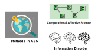

```{r xaringan-themer, include=FALSE, warning=FALSE}
#This block contains the theme configuration for the CSS lab slides style
library(xaringanthemer)
library(showtext)
style_mono_accent(
  base_color = "#5c5c5c",
  text_font_size = "1.5rem",
  header_font_google = google_font("Arial"),
  text_font_google   = google_font("Arial", "300", "300i"),
  code_font_google   = google_font("Fira Mono")
)
```

```{r setup, include=FALSE}
options(htmltools.dir.version = FALSE)
```

layout: true

<div class="my-footer"><span>David Garcia - Foundations of Computational Social Systems</span></div> 

---

# About me

.pull-left[
.center[
```{r, echo=FALSE, out.width=270}
knitr::include_graphics("Profile.jpg")
```
]]

.pull-right[
<br>
Website: [dgarcia.eu](https://dgarcia.eu)

Twitter: [@dgarcia_eu](https://twitter.com/dgarcia_eu)

Github: [dgarcia-eu](https://github.com/dgarcia-eu)

Email: dgarcia@tugraz.at
]

- Professor for Computational Behavioral and Social Sciences, TU Graz
- Professor for Social and Behavioral Data Science, University of Konstanz
- Faculty member of the Complexity Science Hub Vienna
- Privatdozent at ETH Zurich

---
background-image: url(VennV2-1.svg)
background-size: 97%
---
background-image: url(VennV2.svg)
background-size: 97%
---

## Research lines
```{r, echo=FALSE, out.width=1000, fig.align='center'}

```

---
background-image: url(AboutUS.svg)
background-size: 98%
---

# Course objectives

1. Learning the fundamentals of computational methods and data science to study **human behavior** and technological phenomena in the digital society. 

2. To understand methodological **opportunities and limitations**, as well as how to apply these methods in practical sessions.

3. How to plan, execute, and reflect on the **empirical analysis** of digital trace data to address questions about human behavior and emergent technological phenomena. 

4. Special emphasis on an **interdisciplinary approach** that can inform students from various disciplines.

---

# Course topics
  - **1.1. Introduction to Computational Social Systems**
  - **1.2. Search Behavior**


  - **2.1. Social Trends**
  - **2.2. Social Impact**


  - 3.1. Social Media Text Analysis
  - 3.2. Sentiment Analysis


  - 4.1. Social network analysis 
  - 4.2. Centrality in social networks 


  - 5.1 Social resilience
  - 5.2 Societal and ethical issues 

---

# Exercises and practical sessions

- Exercise practical sessions are provided over the semester (Oct 18 - Jan 27)
- There are two exercise groups: Tuesdays and Thursdays

  - Exercise 1: Future orientation and economic development
  - Exercise 2: Division of impact on Twitter
  - Exercise 3: Evaluating sentiment analysis methods
  - Exercise 4: Twitter network analysis

- Self-organized groups: attendance is not mandatory, you can go to any (or both if that helps)
- Online support is available on Discord
- Your tutor will be Moritz Erlacher

---

# Time, place, online

- First part: 5-day block course of lectures (Oct 6 - Oct 14)
  - Oct 6 in person at HS i3 (here)
  - Oct 7 from 13:00 in person at HS L (Alte Technik) - social afterwards
  - Oct 11, 13, 14 online on webex
  - All session recordings will be available in TU Graz online


  
- Second part: practical exercises  (Oct 18 - Jan 27)
  - All in person, none will be streamed or recorded
  - Group A: Tue 13:00 in HS II
  - Group B: Thu 14:15 in HS i3


- Github materials: https://github.com/dgarcia-eu/FoundationsOfCSS-TUGraz
- Foundations of CSS Discord (only this course): https://discord.com/invite/eXWgdu7gn2 Use it to ask for help!
- Teach Center: https://tc.tugraz.at/main/course/view.php?id=4072


---


# Projects information

The assessment for the course is based on the final group research project.
Groups can have at most 4 students and must mix students with different backgrounds.

- Empirical analysis project: data retrieval, processing, analysis, and interpretation. 

- Research questions are very important! (more about that later)

- Can be linked to project in Introduction to CSS. Great opportunity to start working together on a follow-up project in the programme

- Day 5 of the block course has more information and project examples

---

# Course assessment

- The **group** project grade is a combination:
  - ten-minute presentation (50%)
  - six-page written report on the project (50%).

- **Individual** extra points (max 20%) can be achieved by delivering solutions to optional exercises
  - Each exercise is worth 5%
  - Grade is pass/fail
  - Feedback on solutions will be available in practice tutorials
  - Deadlines are listed on Github, submissions over Teach Center

- **Questions?**
