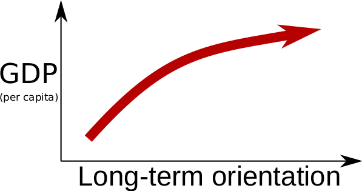
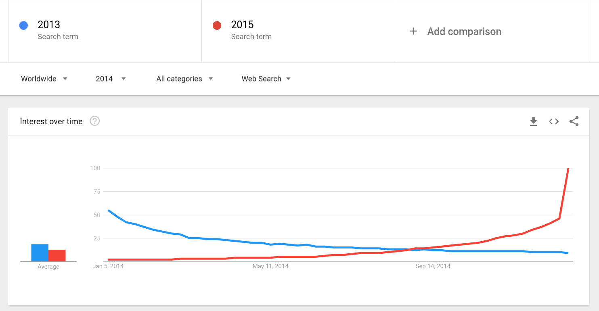
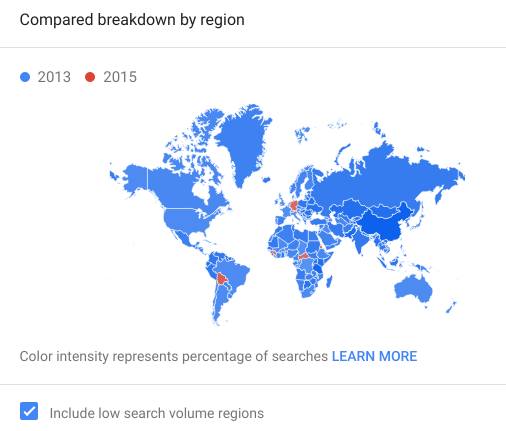
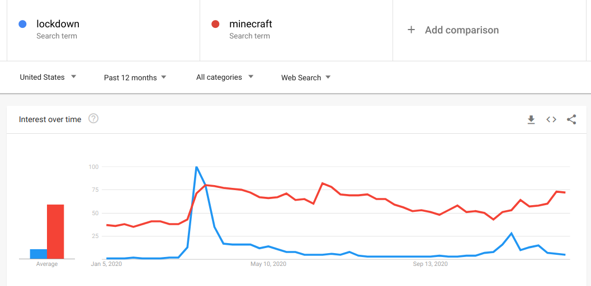
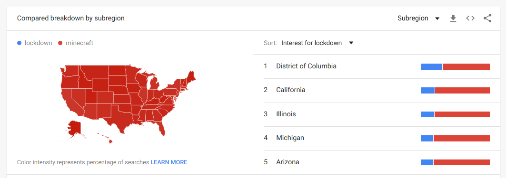
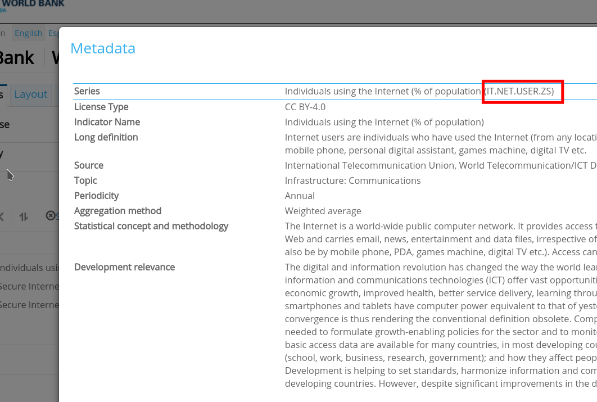

### Time, culture, and the economy

What is the relationship between culture and the economy? Max Weber proposed that culture shapes economic activity, especially as individualist cultures develop free markets. Karl Marx proposed the opposite: that economic relationships shape cultural values and shape institutions. These are not exclusive, there is an interplay between culture and the economy, and this topic focuses on a particular aspect of culture:

> **Long-Term Orientation (Geert Hofstede)**  
Long-term oriented societies believe that the most important events in life will occur in the future; short-term oriented societies believe that those events occurred in the past or take place now.

Geert Hofstede developed a model of culture based on surveys to IBM employees around the world, which then he expanded to culture in general. He identified six dimensions that differentiated work cultures:
individualism, uncertainty avoidance, power distance, masculinity, long-term orientation, and indulgence. You can see the values measured for various cultures on [this website](https://www.hofstede-insights.com/product/compare-countries/).

Long-term orientation is postulated to have a relationship with economic development. In particular [Hofstede hypothesizes](http://mchmielecki.pbworks.com/w/file/fetch/64591689/hofstede_dobre.pdf) that a poor country that is short-term oriented usually has little to no economic development, while long-term oriented countries continue to develop to a point. 

If we measure economic development as the Gross Domestic Product per capita of a country, this hypothesis can be depicted as a function like this:



### Measuring the Future Orientation Index

[Pres et al. 2012](https://www.nature.com/articles/srep00350) proposed a way to measure how much a society looks towards the future with Google Trends, the Future Orientation Index (FOI). The FOI for a country *c* on year *y* is calculated as:

<p align=center>
$FOI_{c,y} = \frac{G(y+1,y,c)}{G(y-1,y,c)}$
</p>

where $G(y_1,y_2,c)$ is the Google Trends volume for searches for $y_1$ during year $y_2$ from country $c$. Essentially it measures the ratio of search volume from a country for next year divided by the search volume for the previous year in the same country.

Remember that Google trends gives you search volume information for a search query, in this case a year expressed with Arab numerals (e.g. "2016"). 

A measurement of the FOI for a year in many countries can be done with one visit to Google Trends. For example, for the year 2014:

{width=60%}{width=40%}

You can see that the search volume for "2013" decreased over the year 2014 and that the volume for "2015" increased over the year and had a spike close to the end of the year. The map shows you that most countries searched more for "2013" than for "2015" in 2014.


### Exporting a Google Trends time series as csv

You can visit https://trends.google.com/ to make a query and download the data as csv. For example, if you query the terms "lockdown" and "minecraft", the first graph you see is this one:



The arrow button allows you to download a csv version of the data behind the plot. The first lines of the file will look approximately like this:

```
Category: All categories
   
Week,lockdown: (United States),minecraft: (United States)
2020-01-05,1,37
2020-01-12,1,36
2020-01-19,1,38
```

You might see the headers in another language if you are using a Google account with certain language settings.


### Exporting a Google Trends map as csv

Below the time series plot, Google Trends offers a map comparing a region. The above query was for the US, but you can configure it for the whole world or for another country or area:



Clicking on the same download symbol, you will download a file that looks like this:  
```
Category: All categories

Region,lockdown: (1/3/20 - 1/3/21),minecraft: (1/3/20 - 1/3/21)
Utah,8%,92%
Alaska,6%,94%
Idaho,8%,92%
```

### Disambiguated trends

On Google Trends you can also search for freebase entries. This way, Google disambiguates and translate search terms, mapping them to entry terms like "Zürich (city in Switzerland)" to the code "/m/08966". You can see the freebase entry for Zurich at https://freebase.toolforge.org/m/08966 . You can do the same for any code, appending it at the end of https://freebase.toolforge.org to see what the database entry refers to.

For example, you can search for terms across languages like this:


Here, "Jesus" has been disambiguated to the id "/m/045m1_" and "Mohammad" to the id "/m/04s9n". Google trends shows the volume aggregated for queries including the way to say both words in other languages.


### The World Bank Development Indicators

The World Bank was founded in 1944 with the goal of reducing poverty in the world. It contains five agencies and almost every country is a member of the World Bank. One of its functions is to keep track of the economic development of many countries. [The World Development Indicators (WDI)](https://databank.worldbank.org/source/world-development-indicators) is a collection of data for different countries over as long as possible. You can explore the database through their [online interface](https://databank.worldbank.org/source/world-development-indicators).

This kind of development data can give great insights. You can find great examples of visualizations of development indicators at https://www.gapminder.org/tools/ like this one:


To know more, check Hans Rosling's talk ["The best stats you’ve ever seen."](https://www.ted.com/talks/hans_rosling_shows_the_best_stats_you_ve_ever_seen
)

### How to find an indicator

To search for indicators, you can do so at the [WDI online interface](https://databank.worldbank.org/source/world-development-indicators). Here the search is much smarter and you can find more information on each indicator. On the tab "Series" in the left menu, you can search for an indicator. For example, if you are searching for internet penetration:

{width=50%}

You can look up the detailed description of an indicator by clicking on the "i" button next to its name:

{width=50%}

I recommend you to take a look at the data on the WDI online interface to check that the countries you expect have the indicator. You can easily procue a plot with the time series of an indicator in a country or a table for you to take a closer look. Some indicators are repeated and might have worse coverage, so make sure you find the right one for your analysis!

### Some useful indicators

Finally, here's a list of indicators that I have found useful in previous work:

- NY.GDP.PCAP.PP.KD: GDP per capita in international USD, i.e. corrected for purchase power  
- SP.POP.TOTL: Total population  
- IT.NET.USER.SZ: Internet penetration  
- SP.POP.TOTL.FE.ZS: % of female population
- SL.UEM.TOTL.NE.ZS: Unemployment as % of labor force  
- GB.XPD.RSDV.GD.ZS: Research & Development expenditure as % of GDP


