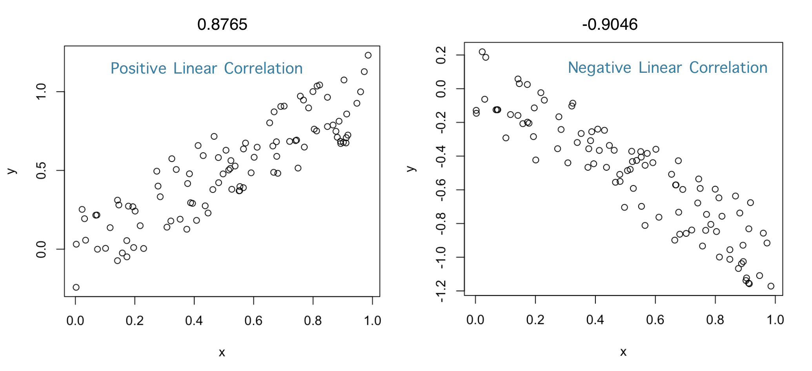
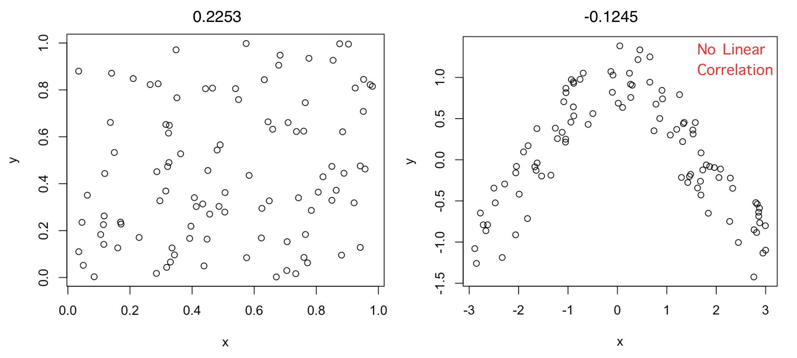

```{r xaringan-themer, include=FALSE, warning=FALSE}
#This block contains the theme configuration for the CSS lab slides style
library(xaringanthemer)
library(showtext)
style_mono_accent(
  base_color = "#5c5c5c",
  text_font_size = "1.5rem",
  header_font_google = google_font("Arial"),
  text_font_google   = google_font("Arial", "300", "300i"),
  code_font_google   = google_font("Fira Mono")
)
```

```{r setup, include=FALSE}
options(htmltools.dir.version = FALSE)
```

layout: true

<div class="my-footer"><span>David Garcia - Foundations of Computational Social Systems</span></div> 

---

# Some univariate statistics notation


- $X$ is a random variable
  - In data: $X_i$ is the value of the variable for entry $i$
  - For example the GDP of a country

- $E[X]$ is the expected value of $X$
  - We estimate the expected value as the mean of $X$: 
  $$\mu_X = \frac{1}{N}\sum_i X_i$$
  - $N$ is the number of data points, for example the number of countries

---

# Some more univariate statistics notation

- $V[X]$ is the variance of $X$
  - We calculate it as the expected squared difference to the mean X: 
  $$V[X] = \frac{1}{N}\sum_i (X_i - \mu_X)^2$$
  - It is measured in squared units of $X$

- $\sigma_X$ is the standard deviation of X
  -  $\sigma_X = \sqrt{V[X]}$, which is convenient because it measures dispersion in the same units as $X$
  - You can calculate it with the function sd() or std()

---

## Pearson's Correlation Coefficient $\rho(X,Y)$

> **Correlation:** Linear association or dependence between the values of variables $X$ and $Y$
 
- If $X$ and $Y$ are independent, they satisfy that the expectation of the product equals the product of expectations:  
$$E[XY] = E[X]E[Y]$$  
- The principle: correlation as the deviation from $E[XY] − E [X]E[Y] = 0$  
- The absolute value of this difference can be at most $\sigma_X\sigma_Y$  
- $\rho(X,Y)$ rescales the difference to be between −1 and 1  

$$\rho(X,Y) = \frac{E[XY] − E [X]E[Y]}{\sigma_X\sigma_Y}$$
---

### Some examples of Pearson's Correlation Coefficient


---


Independent variables will have a correlation close to zero, but a correlation close to zero does not mean independence
---
## Anscombe's quartet  ( $\rho=0.816$ )

.center[]
---
## The Datasaurus dozen
.center[]

---

# Summary of block 2

- **Temporal orientation and Google trends**
  - The interplay between culture and the economy
  - The Future Orientation Index
  - Exporting Google Trends over times and countries
  - The World Bank database
  

- **Google Flu trends**
  - When google trends started overestimating flu incidence
  - All data is better than Big Data
  - Beware of making Data Piñatas
  

- **Measuring correlation**
  - Quantifying linear associations as a violation of independence property
  - Not all correlations are the same and many patterns are not linear
  
  
