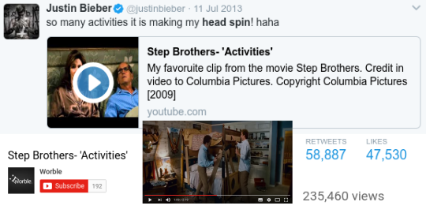
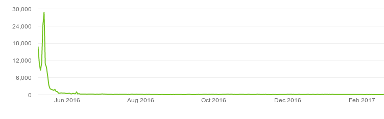
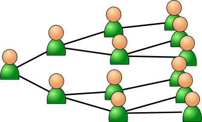
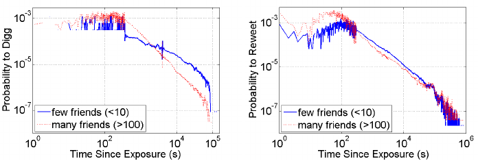
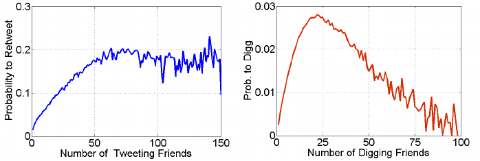

### Online Social Influence as Social Impact

In 2013, Justin Bieber tweeted the URL to a Youtube video to his 40 million followers. In one day the video received more than 100,000 views, you can see the video information and the tweet below. However, the next day, the video received very few views, despite having so many the day before. This is an example of the **Justin Bieber effect**: a strong and ephemeral spike of attention due to an influential individual sharing a link to its followers. The situation we describe here can be understood as a case of **social impact**, where the behavior being adopted by people is watching or sharing a Youtube video.

You can see the time series of the number of views of the video below. Despite the jump, the quick decrease shows that the response is subcritical, as only the fans and followers of the influential individual follow the link, while this does not spread through their friendship networks.

On the contrary, when the response is supercritical, we have sufficiently strong sharing tendencies to overcome people forgetting about the video. In that case, you have a spreading pattern similar to what is depicted below: an individual starts influencing its direct contacts, but as they influence others, the total audience in the end can be very large. This is what is often called "viral marketing", making an analogy to the content spreading like a virus. Below we are going to see more about how well that analogy holds.

### Analysis of Online Social Impact

Social impact has been studied in the case of online settings by analyzing observational data on which users share or consume content and who is connected to whom. Here, the change in behavior tends to be an online action like watching a video, retweeting a tweet, or liking a post. An overview of some of these effects can be found in Kristina Lerman's review ["Information Is Not a Virus, and Other Consequences of Human Cognitive Limits"](http://www.mdpi.com/1999-5903/8/2/21).Two of the best examples of analysis of online social impact are based on data from [Digg](https://ieeexplore.ieee.org/document/6406290) and from [Twitter](https://dl.acm.org/doi/abs/10.1145/1963405.1963503).

The effect of immediacy on impact can be observed both on Digg and on Twitter. The figure below shows the probability of a user "digging" a link, which was a way of sharing some content, as a function of the time since the user received a notification about the link being shared by one of their friends. The two lines correspond to users with few friends and with many friends. You can see that the probability goes down over time, in fact really fast because the vertical axis is logarithmic. On Twitter you see something similar for retweeting as a function of time passed since someone got a tweet through one of their friends. The probability decreases very fast from about two minutes, reaching probabilities below one in a million after a bit more than a day. From this, you can conclude that the hypothesis of the effect of immediacy as time lag in Social Impact Theory is consistent with what you can observe on Digg and Twitter.

### Limits to the psychosocial law

Using the same data, one can test the psychosocial law: The extent of impact growing monotonically with the number of exposures and showing diminishing returns. Below you can see the probability of a user retweeting or digging some content as a function of the number of friends who already did so:

  
You can see the sublinear curve of impact for a person (probability of digging or retweeting) as a function of the number of sources (number of friends who digged or retweeted). An interesting observation is the inverse U-shape for the case of Digg: when too many of the friends of a person have already done it, the probability decreases. Social Impact Theory predates social media by several decades and a case with such a large $N$ was beyond the implied range of number of sources. For example, the experiment in the high school had at most $N=8$. As information overload is a recent phenomenon, social science theories need to be adapted to include it.

The plateau in the probability of retweeting and the inverse U-function of the probability of digging contradict the analogy of online information spreading as a virus. If it spreads as a virus, every exposure counts until you are infected, and thus the probability of spreading it should grow with every friend who exposes you to the content. Reality online is different as in the viral analogy, and the shapes shown above are sometimes referred to as "complex contagion". You can learn more about complex contagion on an experiment with [social bots on Twitter published in 2017](https://journals.plos.org/plosone/article?id=10.1371/journal.pone.0184148).

### Observing the division of impact

The division of impact can be seen on Twitter too. [In my own research,](https://osf.io/preprints/socarxiv/9ve3x/) I analyzed the impact of a Twitter user as a function of the number of their followers, testing if the impact per follower decreases with the number of followers. If we sum up all cases of influences, this translates into a sublinear growth of the total impact of a user with the number of followers they have:

{width=75%}

On the above figure you can see the results of the analysis of the mean number of retweets of users as a function of their number of followers (popularity). The various lines you see correspond to users with different centralities, calculated with a method that you can learn in the centrality topic later in the course. You can see that most lines are sublinear, lending evidence to the division of impact hypothesis. Only for very central users it seems to approach linearity, but not really becoming superlinear. In one of this course's exercises, we will test the division of impact hypothesis with your own Twitter data.

