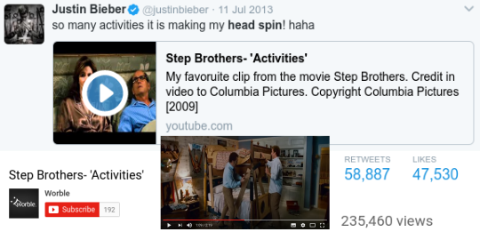
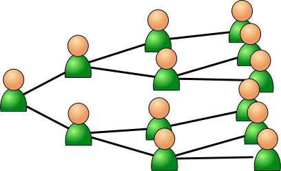
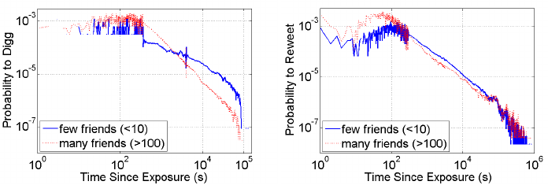
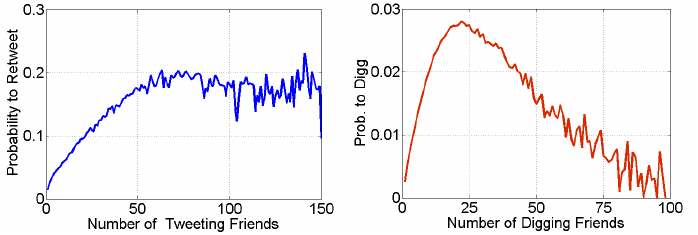
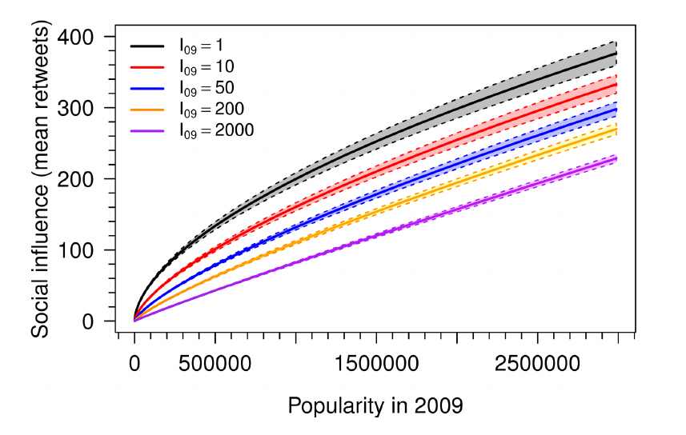

```{r xaringan-themer, include=FALSE, warning=FALSE}
#This block contains the theme configuration for the CSS lab slides style
library(xaringanthemer)
library(showtext)
style_mono_accent(
  base_color = "#5c5c5c",
  text_font_size = "1.5rem",
  header_font_google = google_font("Arial"),
  text_font_google   = google_font("Arial", "300", "300i"),
  code_font_google   = google_font("Fira Mono")
)
```

```{r setup, include=FALSE}
options(htmltools.dir.version = FALSE)
```

layout: true

<div class="my-footer"><span>David Garcia - Foundations of Computational Social Systems</span></div> 

---

# An example of online social influence

.center[  ]

---

# Online spreading of behavior
.center[
  
]
 Kristina Lerman's review ["Information Is Not a Virus, and Other Consequences of Human Cognitive Limits"](http://www.mdpi.com/1999-5903/8/2/21).Two of the best examples of analysis of online social impact are based on data from [Digg](https://ieeexplore.ieee.org/document/6406290) and from [Twitter](https://dl.acm.org/doi/abs/10.1145/1963405.1963503).

---

# Effect of immediacy
.center[  ]

Probability to adopt behavior decreases very fast with time since exposure.

---

# Limits to the psychosocial law online
.center[  ]

Growth in impact stops at some point or even reverses. Effect of information overload not hypothesized by Social Impact Theory.

---

# Observing the division of impact

.center[  ]

