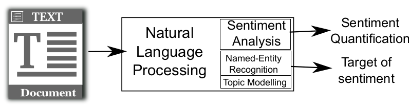
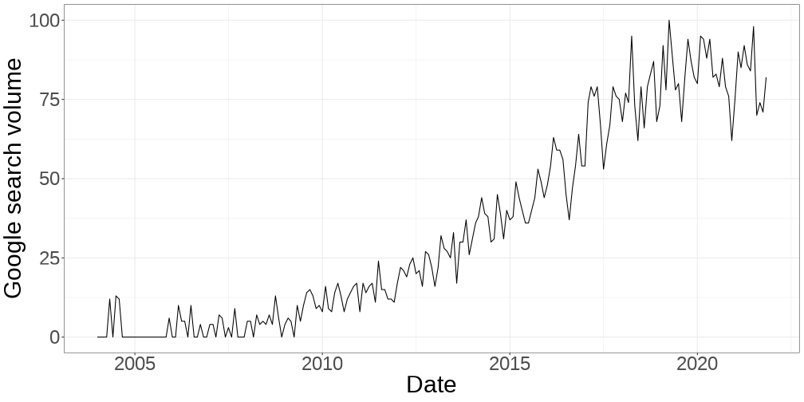
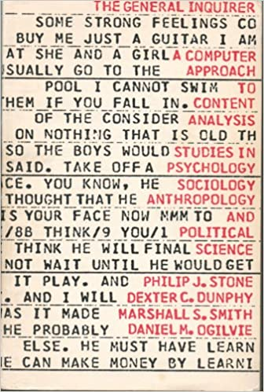

```{r xaringan-themer, include=FALSE, warning=FALSE}
#This block contains the theme configuration for the CSS lab slides style
library(xaringanthemer)
library(showtext)
style_mono_accent(
  base_color = "#5c5c5c",
  text_font_size = "1.5rem",
  header_font_google = google_font("Arial"),
  text_font_google   = google_font("Arial", "300", "300i"),
  code_font_google   = google_font("Fira Mono")
)
```

```{r setup, include=FALSE}
options(htmltools.dir.version = FALSE)
```

layout: true

<div class="my-footer"><span>David Garcia - Foundations of Computational Social Systems</span></div> 

---

#  What is Sentiment Analysis?

> **Sentiment Analysis:** Computerized quantification of subjective states from text

.center[]

- Examples of subjective states: Emotions, feelings, attitudes, opinions...  
- Often vaguely defined and roughly equivalent to the dimension of valence in the circumplex model
- Sentiment quantification can have various formats: polarity, scores, labels...  

---

# The Sentiment Analysis Boom

.center[]


---

# Supervised vs Unsupervised Methods

- **Unsupervised sentiment analysis:**  
  - Uses expert knowledge (e.g. from psychologists) to quantify emotions  
  - Expert knowledge is encoded as a set of rules or a lexicon (dictionary) of words. Also known as "dictionary methods"  
  - Pros: Simple implementation, large coverage and recall  
  - Cons: Hard to customize for a particular context, low precision, expert bias

- **Supervised sentiment analysis:**  
  - Uses a set of annotated texts to fit a model  
  - Annotations can come from readers or the authors of texts  
  - Pros: Automatic calibration, high precision  
  - Cons: Lower recall and coverage, need very large training datasets  

---

# The General Inquirer

<div style="float:right">
  
</div>

The pioneer work of [Philip Stone in 1966](https://mitpress.mit.edu/books/general-inquirer
) proposed to process text with a computer to detect the use of words of various categories. This set the basis for **dictionary methods** in unsupervised sentiment analysis, which are based on counting the number of appearances of the words of a list in a text. 

The lists of positive words and of negative words of this version, which served as input for later methods like [SentiStrength](http://sentistrength.wlv.ac.uk/).


---

## Linguistic Inquiry and Word Count (LIWC)

.center[]  
LIWC (pronounced "Luke") was developed as a click-and-run software by [James Pennebaker in 2001](https://liwc.wpengine.com/), including word lists for emotions and ther classes.

---

# SentiStrength

</br>

.center[]

---

# VADER 
<div style="float:right">
  
</div>

VADER (Valence Aware Dictionary and sEntiment Reasoner) is a tool very similar to SentiStrength in the steps it follows:

1. Text preprocessing  
2. Word matching from a lexicon of positive/negative scored words  
3. Application of modifiers to the scores based on language rules
 
VADER's name suggests it is the "dark version" of LIWC ("Luke"). As the authors of VADER say: *"VADER distinguishes itself from LIWC in that it is more sensitive to sentiment expressions in social media contexts."*

