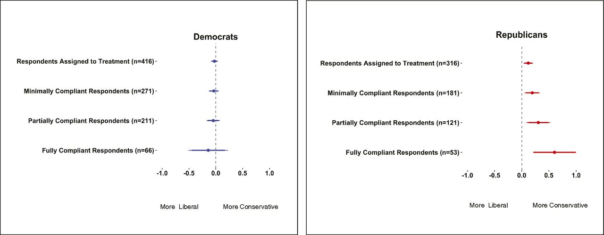

```{r xaringan-themer, include=FALSE, warning=FALSE}
#This block contains the theme configuration for the CSS lab slides style
library(xaringanthemer)
library(showtext)
style_mono_accent(
  base_color = "#5c5c5c",
  text_font_size = "1.5rem",
  header_font_google = google_font("Arial"),
  text_font_google   = google_font("Arial", "300", "300i"),
  code_font_google   = google_font("Fira Mono")
)
```

```{r setup, include=FALSE}
options(htmltools.dir.version = FALSE)
```

layout: true

<div class="my-footer"><span>David Garcia - Foundations of Computational Social Systems</span></div> 

---
# Definitions: Opinion polarization

```{r, echo=FALSE, out.width=480, fig.align='center'}

```

**Opinion polarization:** Two opinion groups with extreme distance in between
[Political Polarization in the American Public. Fiorina & Abrams (2008)](https://www.annualreviews.org/doi/10.1146/annurev.polisci.11.053106.153836)

---
# Definitions: Relational polarization

```{r, echo=FALSE, out.width=680, fig.align='center'}

```

**Relational polarization:** Social structure divided into two groups with high internal connectivity and low inter-group connectivity  
[A sign of the times? Weak and strong polarization in the U.S. Congress, 1973–2016. Neal (2020)](https://www.sciencedirect.com/science/article/abs/pii/S0378873317303039)

---
# Echo chambers vs filter bubbles

Early definitions of the filter bubble focused on search results and personalization but not on polarized social structures (algorithmic definition). </br>
[The filter bubble: What the Internet is hiding from you. Eli Pariser (2011)](https://www.amazon.de/Filter-Bubble-What-Internet-Hiding/dp/1594203008)

Axel Bruns's definitions to distinguish echo chambers from filter bubbles:

- An **echo chamber** comes into being where a group of participants choose to preferentially connect with
each other, to the exclusion of outsiders.
- A **filter bubble** emerges when a group of participants, independent of the underlying network
structures of their connections with others, choose to preferentially communicate with each other, to
the exclusion of outsiders.

[Echo chamber? What echo chamber? Reviewing the evidence
Axel Bruns (2017)](https://snurb.info/files/2017/Echo%20Chamber.pdf) </br>
[Are filter bubbles real? Axel Bruns (2019)](https://www.wiley.com/en-us/Are+Filter+Bubbles+Real%3F-p-9781509536443)


---

# Definitions: Affective polarization

```{r, echo=FALSE, out.width=680, fig.align='center'}

```

**Affective polarization:** Extreme support within groups and hate across groups
[The Origins and Consequences of Affective Polarization in the United States. Iyengar et al. Annual Review of Political Science (2019)](https://www.annualreviews.org/doi/abs/10.1146/annurev-polisci-051117-073034)

[Political sectarianism in America. Finkel et al. Science (2020)](https://science.sciencemag.org/content/370/6516/533)

---

## The leaving Facebook experiment: US case

```{r, echo=FALSE, out.width=600, fig.align='center'}

```

[The welfare effects of social media. Allcott et al. (2019)](https://web.stanford.edu/~gentzkow/research/facebook.pdf)
---
### When leaving Facebook makes things worse: The Bosnia case

```{r, echo=FALSE, out.width=900, fig.align='center'}

```

[Testing the effects of Facebook usage in an ethnically polarized setting. Asimovic et al. (2021)](https://www.pnas.org/content/118/25/e2022819118)
---
# Backfire effects on Twitter experiments

```{r, echo=FALSE, out.width=1000, fig.align='center'}

```

[Exposure to opposing views on social media can increase political polarization. Bail et al. (2018)](https://www.pnas.org/content/115/37/9216)
---
# Does social media create polarization?

The role of social media is not the same in all conflicts. 

The question "does social media create polarization?" implies an oversimplification of the problem:
- use of social media (e.g. Facebook vs Twitter)
- the definition of polarization (e.g. affective vs opinions)
- the social context of polarized societies (e.g. partisan vs ethnic).

The issue of polarization is an example of why we need precise and robust definitions, why we need research on many different platforms, and why we need no-WEIRD (Western, Educated, Industrialized, Rich and Democratic) populations in research.
