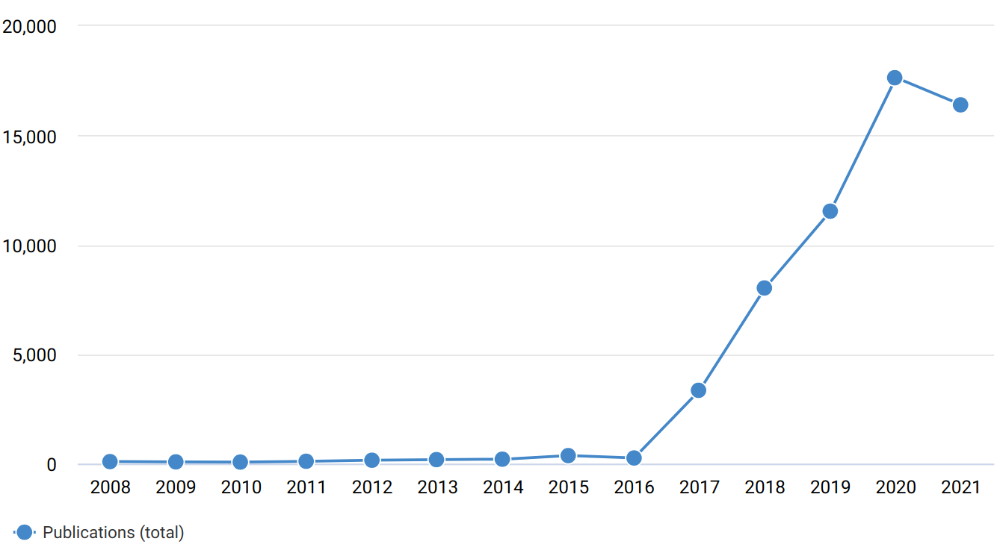
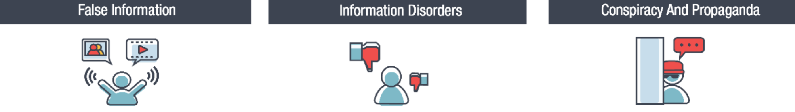
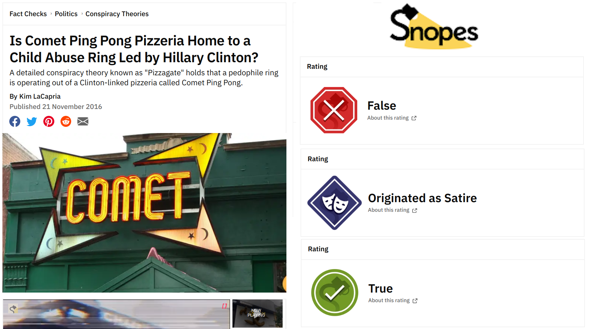
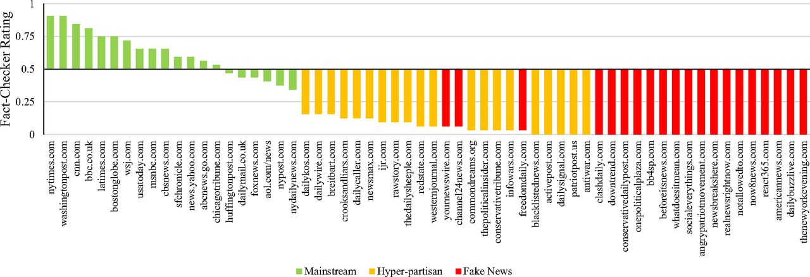
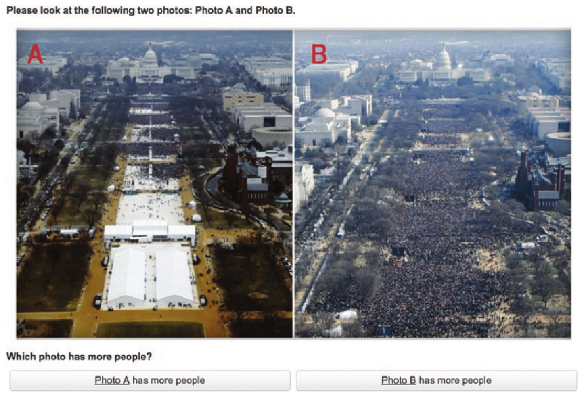
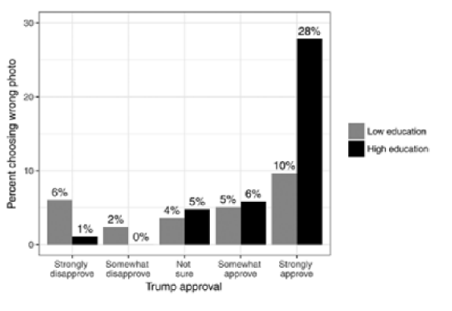
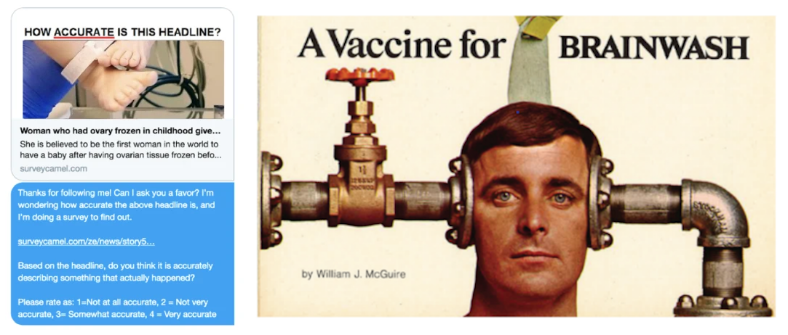

```{r xaringan-themer, include=FALSE, warning=FALSE}
#This block contains the theme configuration for the CSS lab slides style
library(xaringanthemer)
library(showtext)
style_mono_accent(
  base_color = "#5c5c5c",
  text_font_size = "1.5rem",
  header_font_google = google_font("Arial"),
  text_font_google   = google_font("Arial", "300", "300i"),
  code_font_google   = google_font("Fira Mono")
)
```

```{r setup, include=FALSE}
options(htmltools.dir.version = FALSE)
```

layout: true

<div class="my-footer"><span>David Garcia - Foundations of Computational Social Systems</span></div> 

---

# The hot topic of fake news

```{r, echo=FALSE, out.width=800, fig.align='center'}

```
Number of publications including the term "fake news" per year, Dimensions.ai

---

### Fake news during the 2016 US presidential election

```{r, echo=FALSE, out.width=950, fig.align='center'}
knitr::include_graphics("https://img.buzzfeed.com/buzzfeed-static/static/2016-11/2/15/asset/buzzfeed-prod-web06/sub-buzz-8001-1478115629-1.jpg?downsize=700%3A%2A&output-quality=auto&output-format=auto")
```

https://www.buzzfeednews.com/article/craigsilverman/how-macedonia-became-a-global-hub-for-pro-trump-misinfo
---

## Clickbait made in Veles, North Macedonia

```{r, echo=FALSE, out.width=1200, fig.align='center'}

```


[The Macedonian Fake News Industry and the 2016 US Election. H. Hughes and I. Waismel-Manor (2021)](https://www.cambridge.org/core/journals/ps-political-science-and-politics/article/macedonian-fake-news-industry-and-the-2016-us-election/79F67A4F23148D230F120A3BD7E3384F)

---

# Terminology about misinformation

```{r, echo=FALSE, out.width=1200}

```

- **False information:** 
  - False or fake news: news-like content that is verifiably false
  - False rumours: General talk or hearsay not based on factual knowledge
  - Factitious information blends: half-truths and speculations
  - Satire and parody
  - Deep fakes and cheap fakes
  
<div style="font-size:15pt">
Technology and democracy: Understanding the influence of online technologies on political behaviour and decision-making. S. Lewandowsky, et al. (2020)
</div>
 

---

# Terminology about misinformation

```{r, echo=FALSE, out.width=1200}

```

- **Information disorders:** 
  - **Misinformation:** false or misleading content shared without malicious intent
  - **Disinformation:** false or fabricated content shared with the intent to mislead or cause harm
  - **Malinformation:** true information shared to cause harm (hate speech, private information)

<div style="font-size:15pt">
Information disorder: Toward an interdisciplinary framework for research and policymaking. C. Wardle and H. Derakhshan (2017)
</div>

---

# Terminology about misinformation

```{r, echo=FALSE, out.width=1200}

```

- **Propaganda:** Information, especially of a biased or misleading nature, used to promote a political cause or point of view. Can be political or industrial
- **Systematic lies:** Carefully constructed fabrications or obfuscations (e.g. weapons of mass destruction in Irak)
- **Conspiracy theories:** Alternative explanations for traditional news events which assume that these events are controlled by a secret elite group


---

# Comparing fact-checked content

```{r, echo=FALSE, out.width=700, fig.align='center'}

```

<center>**Caution: True Snoped tweets != Legitimate news sharing**</center>
[The spread of true and false news online. S. Vosoughi, D. Roy, S. Aral (2018)](https://www.science.org/doi/10.1126/science.aap9559)

---

# Detection via domain quality lists

```{r, echo=FALSE, out.width=1200, fig.align='center'}

```

<div style="font-size:15pt">
Fighting misinformation on social media using crowdsourced judgments of news source G. Pennycook, D. Rand (2019)

Fake news on Twitter during the 2016 US presidential election. N. Grinberg, et al (2018)
</div>

---

### When the users help spreading: Collaborative disinformation

```{r, echo=FALSE, out.width=530}

```
```{r, echo=FALSE, out.width=540}

```


<div style="font-size:15pt">
Misinformation or expressive responding? What an inauguration crowd can tell us about the source of political misinformation in surveys. Schaffner & Luks. Public Opinion Quarterly (2018)
</div>

Disinformation's spread: bots, trolls and all of us. K. Starbird (2019)
---
 
## Fighting misinformation: priming and inoculation

```{r, echo=FALSE, out.width=950, fig.align='center'}

```

<div style="font-size:15pt">
Shifting attention to accuracy can reduce misinformation online. G. Pennycook, et al. (2021)
</div>
<div style="font-size:15pt">
Countering misinformation and fake news through inoculation and prebunking. S. Lewandowsky, S. Van Der Linden (2021)
</div>


---

# Summary of block 9


- **The story of disappeared social networks**
  - The problem with Google trends data
  - Temporal validity and predictions
  
  
- **Social resilience**
  - Modeling user decisions depending on benefits and costs
  - Coreness centrality to measure resilience


- **Polarization and digital technologies** 
  - Definitions of polarization, filter bubbles, and echo chambers
  - Absence of simple effects and explanations


- **Misinformation and information disorder**
  - Fake news in the 2016 US presidential election
  - Terminology matters: information disorder

